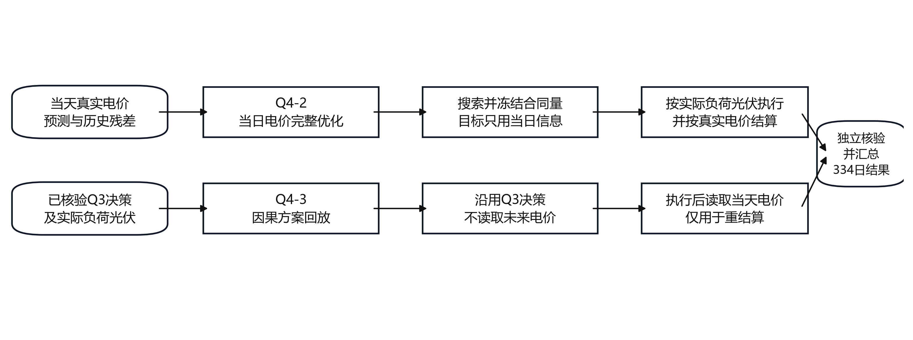
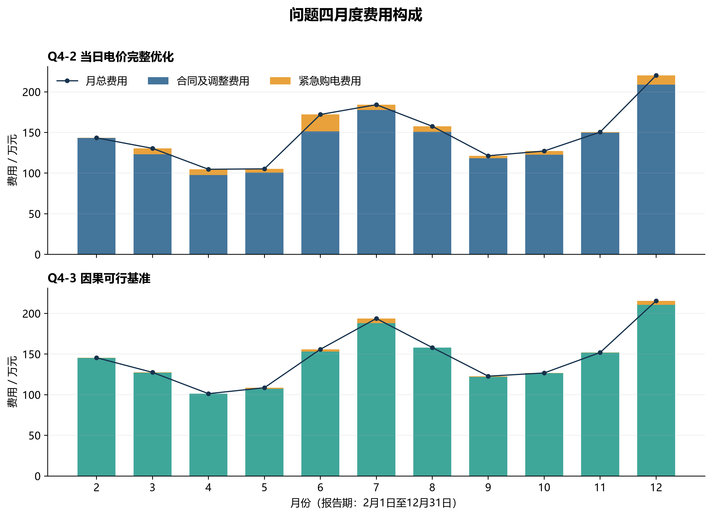
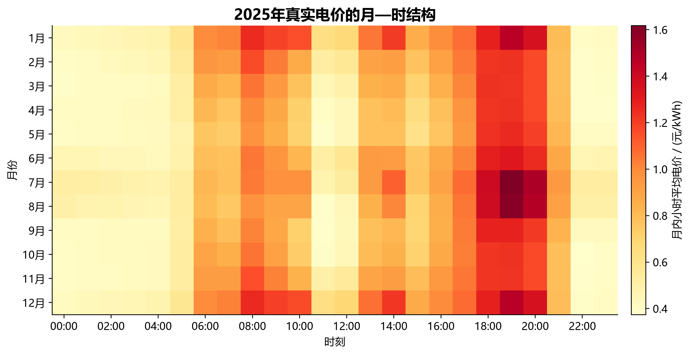
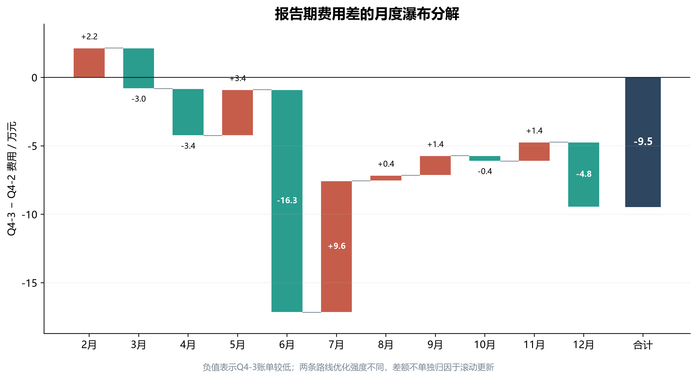
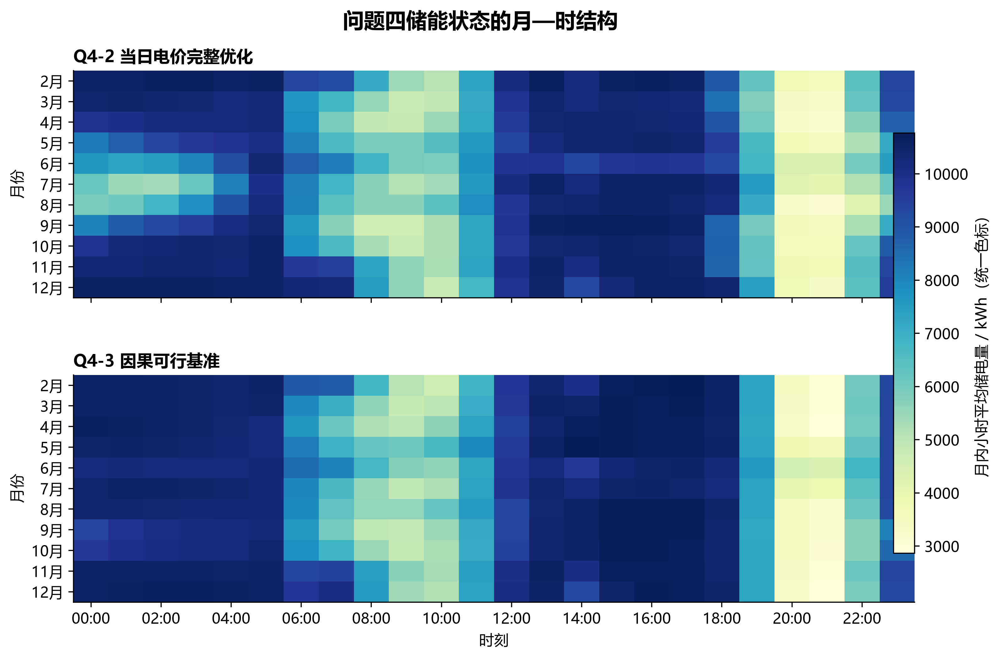

# AI-Assisted Microgrid Rolling Optimization

> 一项从题目审计、随机建模、滚动决策到独立核验的端到端数学建模工程。

[](https://www.python.org/)
[](tests/test_core.py)
[](LICENSE)

## 项目概览

项目研究含光伏、储能和外部电网的微网购电调度。原任务需要在 10 分钟粒度下，结合滚动更新的负荷与光伏预测、分时电价、储能物理约束和紧急购电惩罚，制定全年购电与储能策略。

我把竞赛任务重构为一套可审计的工程流程：先建立数字来源台账和题意口径，再用历史残差构造联合情景，通过样本均值近似评估计划，并让规划层与实际执行层共享同一个因果控制器。最终结果由独立结算函数重新计算，图表从冻结结果生成。

公开仓库提供一个 **144 时段的合成数据演示**，用于展示核心控制、结算和约束检查。竞赛原始附件、身份信息和受限结果未公开。

## 我解决了什么

- 将高额紧急购电损失识别为非对称风险，用高分位安全裕量与情景平均费用代替单纯均值预测。
- 用按天和连续时间块的 bootstrap 保留负荷与光伏误差的联合性和日内相关性。
- 把“计划”和“执行”分开：优化计划时，所有情景都调用同一个只使用当前信息的固定控制器。
- 在每个时间步检查能量平衡、SOC 边界、充放电功率和充放电互斥。
- 将现金结算与调度逻辑解耦，让另一个模块可从决策参数独立复算账单。
- 用人工检查点管理 AI 协作，让题目审计、模型评审、代码实现、验证与写作逐层冻结。

## 工程结构


```text
.
├── src/microgrid_portfolio/   # 控制器、结算器与合成演示
├── tests/                     # 边界、物理约束和确定性测试
├── docs/                      # 架构、AI 协作与验证说明
├── assets/                    # 从完整项目结果中选出的图表
├── .github/workflows/ci.yml   # 自动测试
└── run_demo.py                # 一条命令运行演示
```

## 一条命令运行

```bash
python -m pip install -e .
python run_demo.py
python -m unittest discover -s tests -v
```

运行后会在 `artifacts/` 生成：

- `demo_summary.json`：账单、紧急购电、SOC 与约束残差；
- `demo_dispatch.svg`：合成日的负荷、光伏、合同购电和 SOC；使用标准库生成，无绘图库依赖。

## 代表性可视化

以下图表由完整项目的冻结结果生成，仅作工程成果展示。

### 滚动优化流程



### 月度费用构成



### 真实电价月时热力图



### 月度费用差瀑布图



### 储能状态月时热力图



## AI 协作方式

我将 AI 作为受约束的工程协作者，而不是直接生成论文的黑箱：不同角色分别负责事实提取、策略提出、数学审查、数据处理、编程、独立验证和可视化；关键阶段由人工检查点决定是否继续。所有数字被标记为题目来源、外部核验、建模假设或缺失占位，存在缺失占位时禁止正式求解。

更多细节见 [AI 协作设计](docs/ai-collaboration.md)、[系统架构](docs/architecture.md) 与 [验证策略](docs/validation.md)。

## 面试中可以讨论的取舍

- 为什么均值预测在 5 倍紧急购电价格下会系统性低估计划量？
- 为什么 28 条历史日轨迹不足以稳定估计 144 维误差分布？
- 为什么规划目标必须模拟实际使用的固定控制规则？
- 如何判断边界解、零解或异常一致的结果是否可信？
- 如何让论文、图表和表格读取同一份结构化结果？

## 数据与复现边界

公开演示使用确定性合成数据，不复刻竞赛题目或附件。项目图表来自完整实验的冻结输出；由于原始数据未再分发，图表级结果可审阅，但不能仅凭本仓库重算完整竞赛结果。公开核心代码与测试可独立运行。

## License

[MIT](LICENSE)\n